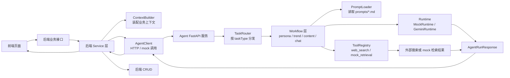
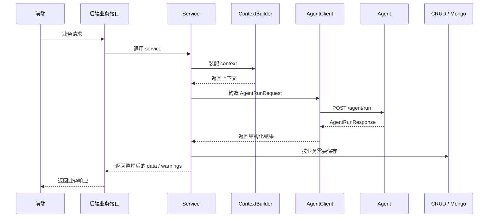
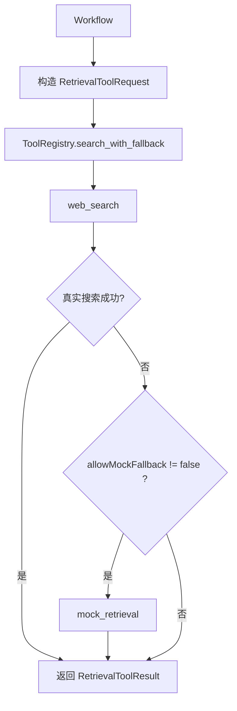

# KOC Agent 架构说明

## 文档目标

本文档基于当前仓库代码，说明 KOC Agent 的真实服务边界、模块分层、调用链路、工具链路、运行时策略，以及当前已经落地与尚未打通的部分。

当前结论：

- Agent 是独立 FastAPI 服务，通过 `POST /agent/run` 对后端提供统一入口。
- 前端不直接调用 Agent，后端业务服务负责装配 `input` / `context`、调用 Agent、处理返回结果。
- 一期覆盖的正式任务仍然是通用聊天、人设打造、热门追踪、内容撰写。
- Agent 不连接后端 MongoDB，不直接保存业务数据。
- 真实模型和真实搜索都已有接入位置，但当前后端主链路默认不开工具。
- 工具能力应作为 Agent 的长期能力保留；当前是否实际执行工具由请求级开关控制。

## 总体架构



## 当前 Harness 主线

在当前 `docs/` 体系里，人设打造、热门追踪、内容撰写不再被视为三套彼此独立的页面逻辑，而统一归入同一种 harness 对话场景。

架构层统一口径：

- 三个场景本质上都是 AI 多轮对话
- 三个场景共用同一条前端 → 后端 → Agent → 后端 → 前端主链路
- 场景差异主要只允许出现在 `taskType`、prompt、context 与结构化结果 schema
- 结果态判定责任应收口到后端，前端只消费结果态与结构化结果

当前 harness 主线中的正式结果态语义：

- `discussionOnly`
- `structuredResult`

映射到业务场景：

- 人设：`personaDraft`
- 热门：`completeAnalysis`
- 内容：`completeDraft`

当前已确认的场景约定：

- 人设页首轮改为走后端 `persona.analyze`
- 热门页采用 `discussionOnly + completeAnalysis`
- 热门完整分析最低标准为 `trackName + trends + audience + topics>=1`
- 内容页采用 `discussionOnly + completeDraft`
- 内容页 suggestions 作为正式结构返回，不再由前端静态规则生成

这意味着：

- 后端 service 层除了“调用 Agent”和“整理字段”，还承担 harness 结果态归一化职责
- 前端页面层后续不应继续扩张各自独立的启发式判定器

总纲与更细的场景协议见：

- [harness-overview.md](./harness-overview.md)
- [harness-scenario-response-contract.md](../02-orchestration/contracts/harness-scenario-response-contract.md)

## 服务边界

### Agent 负责

- 接收 `taskType`、`platform`、`input`、`context`、`options`
- 校验当前仅支持 `platform = xiaohongshu`
- 按 `taskType` 路由到 workflow
- 加载 prompt
- 调用 mock runtime 或 model runtime
- 在允许时调用统一检索工具
- 返回统一 `AgentRunResponse`

补充口径：

- Agent 层应保留“在对话过程中按需使用工具”的能力
- 后端负责控制当前是否放开工具权限
- 当前代码尚未完全进入“模型自主 function calling / tool loop”，但架构方向应保留该演进空间

### Agent 不负责

- 不直接提供前端业务页面接口
- 不做登录和权限
- 不连接 MongoDB
- 不保存人设、趋势、草稿、聊天等业务数据
- 不为普通用户暴露模型选择能力

### 后端负责

- 对前端暴露业务接口
- 查询、装配上下文
- 调用 Agent
- 解析和二次整理 Agent 返回结果
- 按业务规则保存数据

### 前端负责

- 页面与交互
- 业务请求触发
- 本地状态管理
- 已保存数据与当前会话的展示

## 当前模块分层

| 层级 | 位置 | 当前职责 |
| --- | --- | --- |
| Agent API 层 | `agent/app/api/routes.py` | 暴露 `/health`、`/agent/tasks`、`/agent/tools`、`/agent/run`，以及 Prompt Lab 调试接口 |
| Agent Schema 层 | `agent/app/schemas/agent.py`、`agent/app/schemas/tools.py`、`agent/app/schemas/debug.py`、`agent/app/schemas/jobs.py` | 定义 Agent 请求、响应、工具、调试和 job schema |
| Agent Router 层 | `agent/app/router/task_router.py` | 校验 `platform`、`taskType`，分发 workflow |
| Agent Workflow 层 | `agent/app/workflows/` | 按任务校验输入与上下文，调用 runtime / tools |
| Agent Prompt 层 | `agent/app/prompts/loader.py` 与根目录 `prompts/` | 将 `taskType` 映射到 Markdown prompt |
| Agent Runtime 层 | `agent/app/runtime/` | 当前支持 `MockRuntime` 与 `GeminiRuntime` |
| Agent Tool 层 | `agent/app/tools/` | 当前支持 `web_search`、`mock_retrieval` 和统一检索协议 |
| 后端 Adapter 层 | `backend/app/adapters/agent/` | 构造请求、mock / HTTP 调用 Agent、装配上下文 |
| 后端 Service 层 | `backend/app/services/` | 将 Agent 返回结果转成前端可消费数据 |
| 后端 CRUD 层 | `backend/app/database/crud/` | Mongo 读写 |

## 当前支持任务

### Agent 已支持

| `taskType` | Workflow | 当前状态 |
| --- | --- | --- |
| `general.chat` | `GeneralChatWorkflow` | 已实现 |
| `persona.analyze` | `PersonaWorkflow` | 已实现 |
| `persona.follow_up` | `PersonaWorkflow` | 已实现 |
| `trend.track` | `TrendTrackingWorkflow` | 已实现 |
| `topic.recommend` | `TrendTrackingWorkflow` | Agent 已实现 |
| `content.draft` | `ContentWritingWorkflow` | 已实现 |
| `content.revise` | `ContentWritingWorkflow` | 已实现 |

### 保留任务

- `context.plan`
- `analytics.insight`
- `operation.plan`
- `douyin.content_draft`
- `bilibili.content_draft`

### 后端当前实际接入情况

后端当前已经接入：

- `general.chat`
- `persona.analyze`
- `persona.follow_up`
- `trend.track`
- `content.draft`
- `content.revise`

后端当前还没有单独暴露业务入口：

- `topic.recommend`

## 当前前后端业务路由

### 前端到后端

当前主要业务路由为：

- `POST /api/chat`
- `POST /api/persona/analyze`
- `POST /api/persona/follow_up`
- `POST /api/persona/save`
- `GET /api/persona/{user_id}`
- `POST /api/trends/track`
- `POST /api/trends/save`
- `GET /api/trends/{user_id}/history`
- `GET /api/trends/{user_id}/latest`
- `DELETE /api/trends/{user_id}/record`
- `POST /api/content/draft`
- `POST /api/content/save`
- `GET /api/content/{user_id}/history`
- `DELETE /api/content/{user_id}/record`

### 后端到 Agent

统一走：

```text
POST /agent/run
```

当前后端 `AgentClient` 默认配置：

- `AGENT_USE_MOCK=false`
- `AGENT_BASE_URL=http://agent:8010`

说明：

- 按当前仓库默认方式走 Docker Compose 联调时，后端应通过 `http://agent:8010` 调用 Agent。
- 如果后端与 Agent 都在宿主机本地进程中单独运行，通常再改为 `http://127.0.0.1:8010`。

## 当前后端调用链路



## 当前 ContextBuilder 行为

当前上下文由 [builder.py](../../../backend/app/adapters/agent/builder.py) 负责。

### `persona.analyze`

当前返回：

```json
{
  "userId": "demo-user",
  "history": []
}
```

### `persona.follow_up`

当前返回：

```json
{
  "baseInfo": {},
  "conversationHistory": []
}
```

### `trend.track`

当前返回：

```json
{
  "savedPersona": {},
  "trendHistory": [],
  "conversationHistory": []
}
```

但要注意：

- `_mock_get_trend_history()` 目前始终返回空数组
- 也就是说趋势历史并没有真正注入 Agent 上下文

### `content.draft`

当前返回：

```json
{
  "savedPersona": {},
  "selectedTopic": {
    "topic": "xxx"
  },
  "latestTrendSnapshot": {},
  "draftHistory": [],
  "conversationHistory": []
}
```

### `content.revise`

当前没有独立 builder 方法，`ContentService` 是在草稿上下文基础上再手动补：

```json
{
  "currentDraft": {}
}
```

## Runtime 策略

当前 runtime 由 `BaseWorkflow._runtime_for_request()` 决定。

### `MockRuntime`

适用于：

- 本地无模型 key
- 开发联调
- 测试
- 结构验证

mock 数据来自：

```text
examples/agent-responses/*.json
```

### `GeminiRuntime`

当前虽然类名叫 `GeminiRuntime`，但其实现实际上是：

- 使用 `MODEL_*` 配置
- 走 OpenAI-compatible `/v1/chat/completions`
- 要求返回 JSON

当前模型环境变量：

- `MODEL_API_KEY`
- `MODEL_BASE_URL`
- `MODEL_NAME`

兼容：

- `GOOGLE_API_KEY`
- `GOOGLE_BASE_URL`
- `GOOGLE_MODEL`

## Prompt 链路

当前 prompt 映射：

| `taskType` | Prompt 文件 |
| --- | --- |
| `persona.analyze` | `prompts/persona.prompt.md` |
| `persona.follow_up` | `prompts/persona.prompt.md` |
| `trend.track` | `prompts/trend-tracking.prompt.md` |
| `topic.recommend` | `prompts/trend-tracking.prompt.md` |
| `content.draft` | `prompts/xhs-content-writing.prompt.md` |
| `content.revise` | `prompts/xhs-content-writing.prompt.md` |
| `general.chat` | `prompts/general-chat.prompt.md` |

如果请求里带了 `options.promptOverride`，则优先用覆盖值。

## 工具链路

当前检索链路是：



### 当前已实现

- `web_search`
- `mock_retrieval`

### 当前预留

- `browser_search`
- `xhs_fetcher`
- `builtin_trend_store`
- `official_rule_store`
- `context_provider`
- `agent_memory`

### 重要现状

虽然 workflow 已支持工具调用，但当前后端主链路默认传：

```json
{
  "runtimeProvider": "model",
  "enableTools": false
}
```

所以当前业务联调的默认路径是：

- Agent 有工具能力
- 但后端默认不触发工具

这一点应理解为：

- 当前是“策略默认关闭”
- 不是“架构不支持工具”
- 更不是“未来这些任务不允许智能判断是否需要工具”

## 工具策略分层

当前建议统一按以下两层理解工具系统：

### 能力层

Agent 保留工具能力，包括：

- 工具协议
- 工具注册表
- source 扩展能力
- workflow / runtime 后续演进为更 agentic tool-use 的空间

### 策略层

当前是否实际调用工具，由请求级策略控制：

- `options.enableTools = false`
  - 本轮不执行工具
- `options.enableTools = true`
  - 本轮允许进入工具链路

当前正式业务策略：

- 默认关闭工具
- 保留后续按需放开的能力
- 放开时应尽量朝“Agent 自主判断是否需要工具”演进，而不是长期依赖后端硬编码

## Agent 响应结构

当前 Agent 原生响应包括：

- `requestId`
- `taskType`
- `platform`
- `status`
- `data`
- `savePayload`
- `sources`
- `toolCalls`
- `warnings`
- `error`
- `metadata`

但后端 `backend/app/schemas/agent/protocol.py` 当前只保留并消费了核心字段：

- `data`
- `savePayload`
- `warnings`
- `error`

这意味着当前架构上存在一个明确断层：

- Agent 能提供完整调试信息
- 后端默认不会把 `sources`、`toolCalls`、`metadata` 暴露给前端

## 当前前端状态架构

前端全局状态位于 [AppStateContext.tsx](../../../frontend/context/AppStateContext.tsx)。

当前会统一拉取：

- `GET /api/persona/demo-user`
- `GET /api/content/demo-user/history`
- `GET /api/trends/demo-user/history`

也就是说，当前前端启动时已经会尝试恢复：

- 已保存人设
- 已保存草稿历史
- 已保存趋势历史

这比旧文档里“草稿不会自动恢复、趋势只靠页面 state”要更接近现状。

## 当前自动保存与手动保存差异

### 人设

- `persona.analyze` 返回后，后端 `PersonaService` 会自动消费 `savePayload` 落库
- 前端也可手动调用 `/api/persona/save`

### 趋势

- `trend.track` 结果当前不会自动落库
- 只有前端调用 `/api/trends/save` 才写入 Mongo

### 内容

- `content.draft` / `content.revise` 当前不会自动落库
- 只有前端调用 `/api/content/save` 才写入 Mongo

### 聊天

- `general.chat` 当前不落库

## 当前架构上的主要不一致点

1. Agent 和后端的字段可见性不一致  
   Agent 原生支持 `sources`、`toolCalls`、`metadata`，后端默认不透传。

2. Agent 已支持 `topic.recommend`，后端没单独暴露  
   这会让文档和真实前端路由产生落差。

3. 内容修改入口在后端被折叠进 `/api/content/draft`  
   这和“按 taskType 一一对应业务路由”的理想结构不完全一致。

4. 工具能力已实现，但默认业务主链路不开  
   所以“支持搜索”与“默认业务联调会看到搜索结果”是两回事。

7. 当前工具调用仍偏 workflow 编排式  
   还不是完整的模型自主 tool-calling loop。

5. ContextBuilder 仍有 `_mock_` 命名且趋势历史为空  
   容易让人误判上下文已经完整接入。

## 当前建议的后续架构微调点

1. 后端补齐 Agent 完整响应字段  
   至少让调试页可查看 `sources`、`toolCalls`、`metadata`。

2. 单独暴露 `topic.recommend` 业务接口  
   让 Agent 能力和后端业务路由对齐。

3. 将 `content.revise` 从 `/api/content/draft` 中拆出独立业务接口  
   减少联调混淆。

4. 决定哪些正式链路默认启用工具  
   当前默认 `enableTools=false` 更偏保守开发态。

5. 让 `trendHistory` 真正进入 Agent 上下文  
   当前后端虽有趋势历史接口和 Mongo 存储，但 builder 仍传空。

6. 统一保存策略  
   目前人设是自动保存，趋势和内容是手动保存，策略不一致。

## 当前架构总结

- 当前 KOC 架构已经形成清晰的三层分工：前端展示、后端业务、Agent 结构化生成。
- Agent 独立服务边界已经基本稳定。
- 真正还未完全对齐的地方，不在“有没有架构”，而在“后端是否把 Agent 已有能力完整接出来”。
- 如果下一阶段要提升稳定性，优先级应该放在：字段透传、工具开关策略、上下文完整度、业务保存一致性。
- 工具系统的正式方向应明确为：保留 Agent 智能调用工具的能力，当前用开关控制是否允许执行，正式业务默认关闭。
